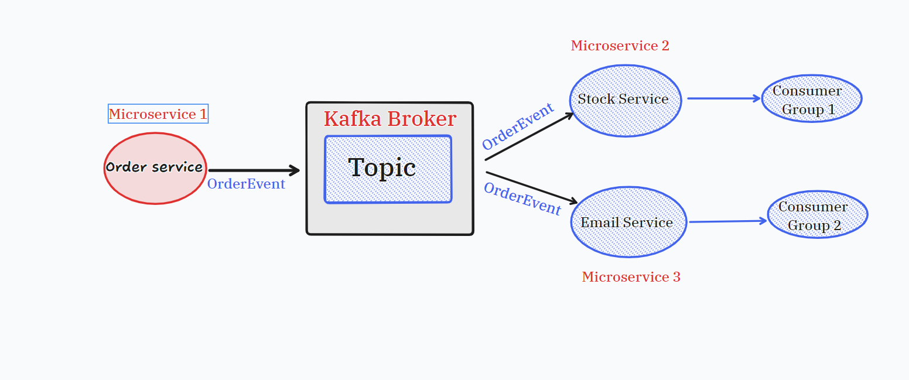

# spring-boot-kafka-demo

This is a simple spring application developed using Spring boot to demonstrate the integration of **[Apache Kafka](https://kafka.apache.org/)** which internally uses **[Zoo Keeper](https://zookeeper.apache.org/)** for managing different Kafka instances as a cluster. 



## Key concepts of Apache Kafka

**Topic**: Topic is a unique representation or category to which producer publishes a stream of data. A topic will be subscribed by zero or multiple consumers for receiving data.

**Producer**: Producer is responsible for sending data to one or more topics and assigning data to partitions within the topic.

**Consumer**: Consumer is responsible for consuming data from one or more topics when the producer sends the data to topics.

**Apache Kafka has a built-in system to resend the data if there is any failure while processing the data, with this inbuilt mechanism it is highly fault-tolerant.**

## Build Instructions

```bash
mvn clean install
```

## Prerequisites
**This application requires Kafka and Zookeeper setup.**
You can download Kafka setup from here **[Kafka](https://kafka.apache.org/downloads)**. Once downloaded, extract into your local machine. Navigate to the extracted folder and run the below commands using windows powershell/terminal if you are using Mac.

To run the zookeeper server

```bash
.\bin\windows\zookeeper-server-start.bat .\config\zookeeper.properties (Windows)

.\bin\zookeeper-server-start.sh  .\config\zookeeper.properties (linux)

```
To run the kafka instance

```bash
.\bin\windows\kafka-server-start.bat .\config\server.properties (Windows)

.\bin\kafka-server-start.sh .\config\server.properties (linux)
```
